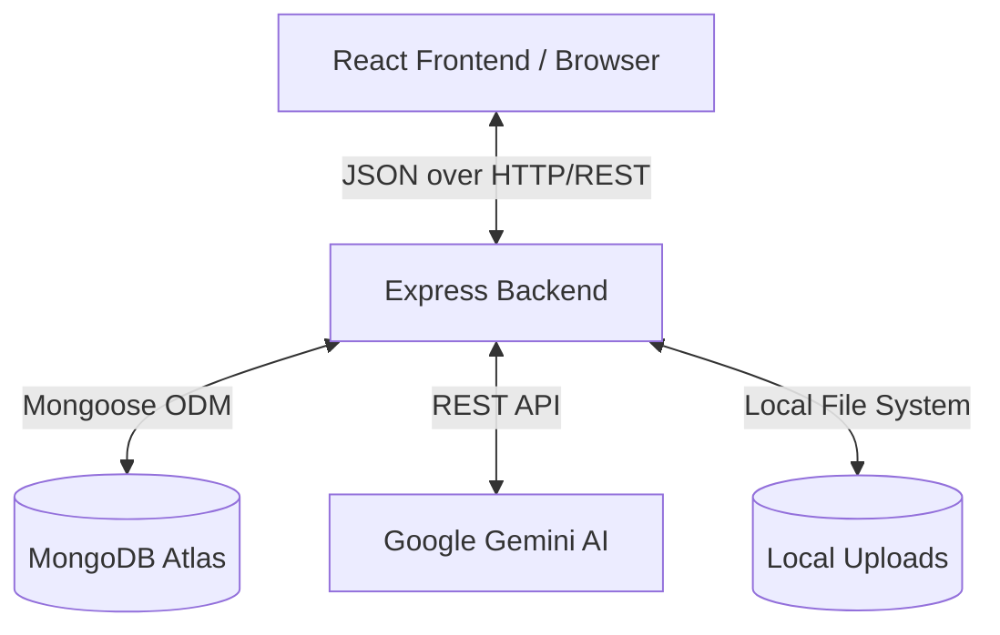

# Architecture Documentation

The AI Job Board is built upon a modern, scalable, and decoupled **Client-Server Architecture** utilizing the **MERN** stack (MongoDB, Express, React, Node.js).

---

## 🏗 Overall System Architecture

The system is fundamentally divided into two isolated environments that communicate exclusively over HTTP/REST:

1. **Frontend (Client)**: A Single Page Application (SPA) executed in the user's browser, responsible for rendering UI, managing client-side state, and handling user interactions.
2. **Backend (Server)**: A stateless REST API responsible for business logic, database transactions, authentication, and external API orchestration (Google Gemini).

### Architecture Diagram

---

## 🎨 Frontend Architecture

The frontend is bootstrapped using **Vite** for optimized HMR and bundling.

### Component Structure
The UI is built using functional React components. 
- **Presentational Components**: Small, highly reusable UI elements (e.g., `Button.jsx`, `Input.jsx`, `Card.jsx`) located in `src/components/ui/`.
- **Layout Components**: Wrappers that provide consistent structure (e.g., `Navbar.jsx`, `DashboardLayout.jsx`).
- **Pages**: Heavy container components mapped to specific routes (e.g., `JobDetails.jsx`, `RecruiterDashboard.jsx`).

### State Management & Context API
Global state is minimized to prevent prop-drilling, relying heavily on the React Context API (`AuthContext.jsx`) exclusively for user session state. Component-level state (e.g., form inputs, toggles) is managed via the `useState` hook.

### Routing
**React Router v7** handles client-side navigation without triggering full page reloads. The application heavily utilizes `Suspense` and `React.lazy()` for code-splitting routes, ensuring users only download the JavaScript necessary for the page they are viewing.

---

## ⚙️ Backend Architecture

The Node.js/Express backend follows a strict **MVC (Model-View-Controller)** pattern, though the "View" is substituted with JSON responses.

### MVC Pattern
1. **Models** (`src/models/`): Mongoose schemas defining the exact structure, data types, and validation rules for database documents.
2. **Controllers** (`src/controllers/`): The core business logic. They receive validated requests, query models, execute AI logic, and return HTTP responses.
3. **Routes** (`src/routes/`): Express routers that map HTTP methods and endpoints to specific Controller functions.

### API Flow
1. An incoming HTTP request hits `server.js`.
2. The request is passed through global middleware (CORS, Helmet, express.json).
3. The request hits a specific route router (e.g., `/api/jobs`).
4. Route-specific middleware executes (e.g., `protect` to verify JWT, `authorize` to verify role).
5. The request reaches the Controller, which interfaces with MongoDB.
6. The Controller returns a JSON response.
7. If an error occurs, it is caught and forwarded to the global `errorMiddleware`.

---

## 🗄 Database Design

MongoDB (NoSQL) was selected to handle the highly varied structures of job descriptions and AI outputs. Data is heavily normalized (using references) rather than embedded, ensuring scalability.

- **Users**: Central authentication collection.
- **Jobs**: References the `recruiter` User and the associated `Company`.
- **Applications**: References the `Job` and the `seeker` User.
- **Companies**: References the `recruiter` User.

*(See [Database Documentation](./Database.md) for deep schema details).*

---

## ☁️ Deployment Architecture

The application is deployed across multiple cloud providers to optimize for specific workloads:
- **Frontend -> Vercel**: Vercel acts as a global CDN, delivering the static React build (`dist/`) to users from edge nodes with near-zero latency.
- **Backend -> Render**: Render hosts the Node.js runtime process, scaling vertically or horizontally as API traffic increases.
- **Database -> MongoDB Atlas**: A managed cloud database cluster handling backups, redundancy, and scaling.
